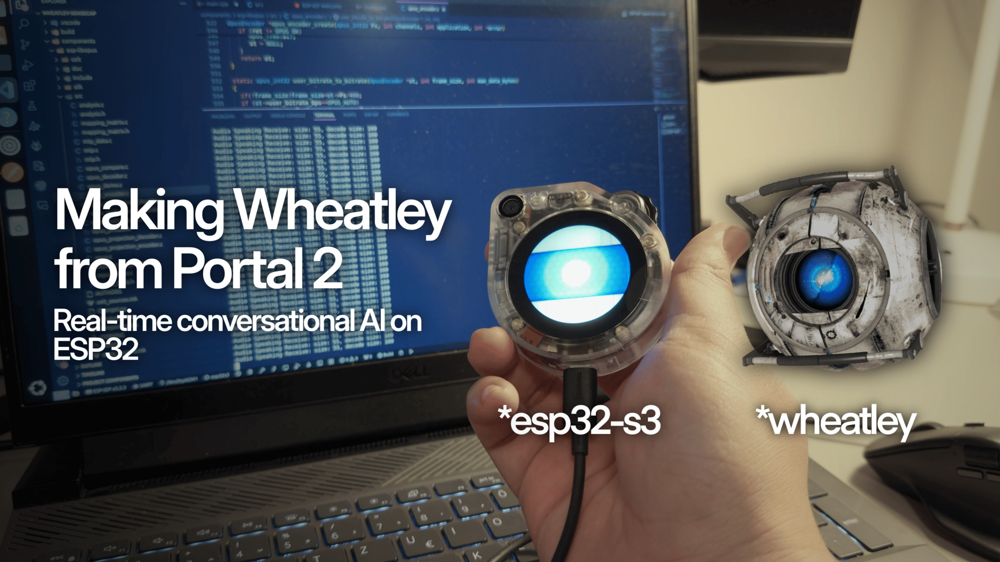

# Wheatly: Real-time conversational AI on ESP32-S3 using LiveKit and WebRTC

This project contains the firmware and LiveKit agent, which if deployed together, can turn a SenseCap Watcher (ESP32S3) into a miniature toy impersonating Wheatly from Portal 2.

https://github.com/user-attachments/assets/b0c4e97e-b597-4790-9cd6-525c81040629

# Requirements

- SenseCap Watcher: [Buy here - 99$ - Coupon: 5EB420ZS](https://www.seeedstudio.com/SenseCAP-Watcher-W1-A-p-5979.html?sensecap_affiliate=3gToNR2&referring_service=link)
- LiveKit API Token: [Get here](https://docs.livekit.io/home/)
- OpenAI API Token: [Get here](https://platform.openai.com/)
- ElevenLabs API Token: [Get here](https://elevenlabs.io/docs/quickstart)

Note: If you buy products from SeeedStudio, you can use this coupon code for a suprise discount: **5EB420ZS**

# Step-by-step Guide

## API Tokens and Preliminaries

To run this project, you'll need accounts on LiveKit, OpenAI and ElevenLabs:

- **LiveKit** is used to create a real time conversational AI with custom components.
- **OpenAI** is used for their Speech-To-Text model (Whisper) and LLM model (GPT4o).
- **ElevenLabs** is used to create an AI voice which resembles Wheatley.

## Repository clone and submodule update

```bash
git clone https://github.com/pham-tuan-binh/wheatley-ai.git
cd wheatly-ai
git submodule update --init --recursive
```

## Firmware

```bash
# Firmware directory
cd wheatly-sensecap
ls
```

This project firmware is written with ESP-IDF toolchain. To use it, first you compile and flash Wheatley, you'll need to install [ESP-IDF]().

The firmware requires you to have protbuf and protobuf-c installed, due to livekit signaling which uses protobuffer. Tutorials can be found online.

The following Bash commands can be used to help you compile this firmware easily on Ubuntu.

```bash
# Installing protobuf and protobuf-c
sudo apt update
sudo apt install -y protobuf-compiler protobuf-c-compiler
```

From inside the repository, execute the following commands to compile and flash the firmware

```bash
# Set chip target and generate build files
idf.py set-target esp32s3

# Build the firmware
idf.py build

# Flash the firmware
idf.py flash

# View monitor
idf.py --port /dev/ttyACM0 monitor
```

After getting inside the monitor, you can configure the device through serial interface.

```bash
# Please remember, this is not your command line, this is the serial interface of the device, which can be open with monitor command as shown above

# Wifi config
wifi_cta -s "YourWifiSSID" -p "YourWifiPassword"

# LiveKit Config (LiveKit Token Generation Guide Below)
livekit_cfg -u "YourLiveKitProjectURL" -t "YourLiveKitToken"
```

Warning: Before flashing your board firmware, you should backup factory information. This will be useful in case you want to go back to SenseCap Factory Firmware.

```
esptool.py --port /dev/tty.wchusbserial56F3067xxxx --baud 2000000 --chip esp32s3 --before default_reset --after hard_reset --no-stub read_flash 0x9000 204800 nvsfactory.bin
```

## WebRTC Service

From inside the repository, execute the following commands.

```bash
cd wheatly-rtc-pipeline
python -m venv venv
source venv/bin/activate
pip install -r requirements.txt
```

After executing the commands, create an **env.local** file and input your credentials. An example of this can be found in **.env.example**.

```bash
touch .env.local
```

```
LIVEKIT_API_KEY=<your_api_key>
LIVEKIT_API_SECRET=<your_api_secret>
LIVEKIT_URL=wss://<project-subdomain>.livekit.cloud
OPENAI_API_KEY=<your_api_key>
ELEVEN_API_KEY=<your_api_key>
```

To run the server, which is a must if you want to talk to Wheatly, run the following command:

```bash
python agent.py dev
```

To generate the token which is used in the firmware, run the following command:

```bash
python generate_token.py
```

## Web Frontend

If you want to try Wheatly without going through the hassle of getting a SenseCap, you can use the web frontend in addition to the rtc pipeline.

Make sure you have pnpm installed on your system.

```bash
cd wheatley-frontend
pnpm install
pnpm dev
```

# License and Copyright

The project is made by Pham Tuan Binh and distributed under the GNU LESSER GENERAL PUBLIC LICENSE v2.1.

If you wish to commercialize the project, please contact me at binhpham@binhph.am

## Star History

[](https://star-history.com/#pham-tuan-binh/wheatley-ai&Date)
